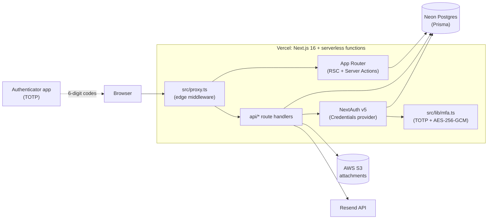
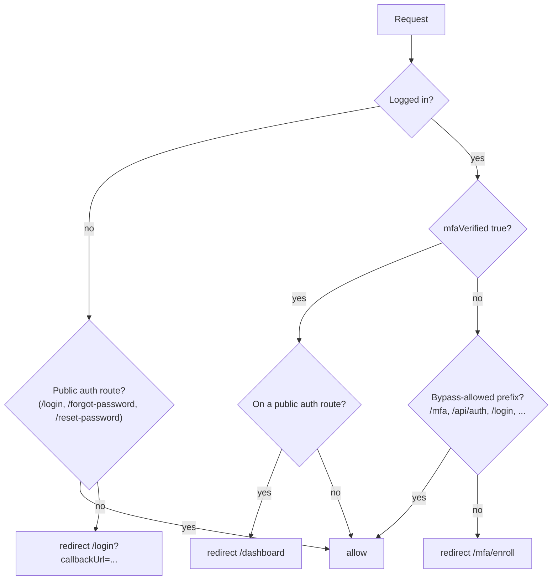
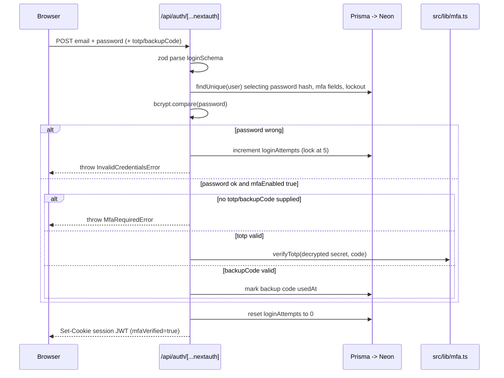

# Engineering onboarding — LS Nexus (ls-crm)

This doc gets a new engineer from a freshly cloned repo to confidently shipping their first PR. It assumes you've read the top-level [README.md](../README.md) (run-the-app instructions, feature list, seeded users). Everything below covers **how the codebase is organised, how to extend it, and how it runs in production**.

If you're skimming, the three sections you actually need on day one are:

1. [Local development](#4-local-development)
2. [Routing and auth flow](#5-routing-and-auth-flow)
3. [Common tasks (cookbook)](#7-common-tasks-cookbook)

---

## 1. Welcome and 5-minute orientation

LS Nexus is a single Next.js 16 app deployed to Vercel, talking to a Neon Postgres database via Prisma. There is no separate backend — every server-side concern lives in the same repo as the UI, either as a Server Component, a Server Action, or an API route.

What you should know on day one:

- The `main` branch auto-deploys to production at `https://www.ls-nexus.com`.
- All authenticated users are forced through MFA (TOTP). There is no way to skip enrollment except for the admin DB-recovery procedure documented in [README.md](../README.md).
- Database access goes **only** through the singleton Prisma client at [src/lib/prisma.ts](../src/lib/prisma.ts). Don't `new PrismaClient()` anywhere else — connection pool exhaustion is real.
- Every protected page receives `session` from `await auth()`; rep-level data scoping happens in the page/handler, not in middleware.

---

## 2. Architecture at a glance



Key non-obvious facts in that diagram:

- The `proxy.ts` file is what Next.js calls "middleware". It is renamed because of the new Next.js 16 convention. See [AGENTS.md](../AGENTS.md).
- NextAuth uses a JWT session strategy (no DB session table). User identity is stored in a signed cookie; `mfaVerified` is a flag on the JWT, not on the DB user.
- The Prisma client is configured as a server-external package in [next.config.ts](../next.config.ts) so it isn't bundled into edge functions.

---

## 3. Repo map

```
ls-crm/
  src/
    proxy.ts                   # Edge middleware: auth + MFA gate + security headers
    app/
      layout.tsx               # Root layout (theme provider, fonts)
      page.tsx                 # Landing page redirect
      manifest.ts, sitemap.ts  # PWA + SEO
      login/                   # /login (public)
      forgot-password/         # /forgot-password (public)
      reset-password/          # /reset-password (public)
      mfa/                     # /mfa/enroll, /mfa/* (auth'd, pre-MFA-verified)
      (dashboard)/             # Route group — all protected app pages
        layout.tsx             # Sidebar, session provider, page-view tracker
        dashboard/             # /dashboard
        customers/             # /customers, /customers/[id]
        products/              # /products
        forecast/              # /forecast
        action-items/          # /action-items
        pipeline/              # /pipeline (deals)
        analytics/             # /analytics
        scoring/               # /scoring
        users/                 # /users (admin)
      api/                     # Route handlers — one folder per resource
        auth/[...nextauth]/    # NextAuth catch-all
        auth/mfa/              # setup, verify-enroll, regenerate-backup-codes,
                               # admin-reset, force-signout
        auth/forgot-password/  # Password-reset email kickoff
        auth/reset-password/   # Token consumption
        customers/             # GET/POST + [id] for CRUD
        products/, forecasts/, action-items/, pipeline/, scoring/, users/
        analytics/             # Reads aggregated stats
        attachments/, upload/  # S3 upload + presigned URLs
        cron/action-items-digest/   # Weekly Resend digest
    lib/
      auth.ts                  # NextAuth config + Credentials provider + lockout
      mfa.ts                   # TOTP generation/verify + AES-256-GCM encryption
      prisma.ts                # Singleton Prisma client (use this everywhere)
      s3.ts                    # uploadToS3, getPresignedUrl, deleteFromS3
      resend.ts                # sendEmail helper + recipient resolvers
      email-templates.ts       # HTML templates for Resend
      division.ts              # getDivisionFilter — multi-tenant scoping
      customer-account-number.ts  # Auto-numbering customers
      pipeline-deal-access.ts  # Authorization for pipeline rows
      scoring.ts               # Account scoring engine
      entity.ts                # Tenant/entity helper
      formatters.ts, utils.ts  # Display helpers, cn() classnames
    components/
      ui/                      # shadcn/ui primitives — don't hand-roll these
      layout/                  # Sidebar, Header, SessionProvider, etc.
      customers/, products/, forecast/, action-items/, pipeline/,
      analytics/, scoring/, users/, dashboard/   # Feature components
    types/
      next-auth.d.ts           # Session/JWT augmentation (mfaEnabled/mfaVerified)
  prisma/
    schema.prisma              # 16 models — User, Customer, Forecast, ActionItem, ...
    migrations/                # Three so far: init, add_entities, add_mfa
    seed.ts                    # Seed test users + sample data
  scripts/
    reset-user-password.ts     # tsx scripts/reset-user-password.ts <email> <new-pw>
  docs/
    engineering-onboarding.md  # This file
    diacom-allowlist-request.md, domain-recategorization.md  # Network policy docs
  public/                      # Static assets (logos, icons)
  .env.example                 # Template — copy to .env
  next.config.ts, vercel.json, tsconfig.json, eslint.config.mjs
  components.json              # shadcn/ui config
```

---

## 4. Local development

### 4.1 Prerequisites

- **Node.js 20+** (Vercel runs Node 24; anything 20 or higher works locally).
- **pnpm 9+** is the package manager of record. `npm install` works but produces a different lockfile — don't commit it. The repo also has a `package-lock.json` from earlier history, but treat `pnpm-lock.yaml` as the source of truth.
- A **Neon** account (free tier is fine) for a personal dev database, OR access to the team's shared Neon project.
- A **TOTP authenticator app** on your phone (Google Authenticator, 1Password, Authy, Microsoft Authenticator).

Optional but useful:

- The Vercel CLI: `pnpm i -g vercel` — needed for `vercel env pull` and `vercel logs`.
- The Neon CLI for branch management: `pnpm i -g neonctl`.

### 4.2 First-time setup

```bash
git clone https://github.com/devlee1980/ls-crm.git
cd ls-crm
pnpm install            # postinstall runs `prisma generate`

cp .env.example .env
# Fill in the values — see section 4.3 below for what each one needs.

npx prisma migrate dev  # apply the 3 migrations to your local DB
npx prisma db seed      # insert the seeded users + sample data

pnpm dev                # http://localhost:3000
```

Sign in with the seeded admin (from [prisma/seed.ts](../prisma/seed.ts)):

```
Email:    lee.mcduffie@lifescientific.com
Password: admin123
```

> The README mentions `admin@lifescientific.com` — that's stale. The seed script uses `lee.mcduffie@lifescientific.com` as the admin and `rep@lifescientific.com / rep123` as the test rep.

You will be redirected to `/mfa/enroll` on first sign-in. Scan the QR code, confirm a 6-digit code, and **save the 10 backup codes** you're shown. After that you'll land on `/dashboard`.

### 4.3 Environment variables

Every variable listed in [.env.example](../.env.example) is required for the app to run. Quick generation cheat-sheet:

| Variable | What it is | How to generate |
|---|---|---|
| `DATABASE_URL` | Neon connection string | Copy from Neon dashboard. Use the **pooled** URL ending in `-pooler...` for production-shaped behaviour. |
| `AUTH_SECRET` | NextAuth JWT signing key | `openssl rand -base64 32` |
| `NEXTAUTH_URL` | Origin used in callbacks | `http://localhost:3000` for dev, `https://www.ls-nexus.com` in prod |
| `NEXT_PUBLIC_APP_URL` | Used in absolute links (emails, etc.) | Same as `NEXTAUTH_URL` |
| `AWS_ACCESS_KEY_ID`, `AWS_SECRET_ACCESS_KEY`, `AWS_REGION`, `AWS_S3_BUCKET_NAME` | S3 credentials | Get from AWS console for the `ls-nexus-crm` bucket |
| `RESEND_API_KEY` | Transactional email | resend.com/api-keys. The `ls-nexus.com` domain must be verified in Resend. |
| `CRON_SECRET` | Bearer token for `/api/cron/*` | `openssl rand -base64 32` |
| `MFA_SECRET_KEY` | AES-256-GCM key for TOTP-secret-at-rest | `node -e "console.log(require('crypto').randomBytes(32).toString('base64'))"` — **must match across every environment that touches the same DB**, or existing enrollments become un-decryptable. |
| `MFA_ISSUER` | Label shown in the authenticator app | `LS Nexus` |

Local Next.js also reads `.env.local` (after `.env`). If you `vercel env pull .env.local`, the values from your linked Vercel **Development** environment will overwrite anything you set in `.env`. Be aware — see [Deployment](#8-deployment-and-environments).

### 4.4 Working with the database

Three commands you'll use repeatedly:

```bash
# After editing prisma/schema.prisma:
npx prisma migrate dev --name describe_what_you_changed

# Without changing the schema, regenerate the client:
npx prisma generate

# Open a GUI to browse data:
npx prisma studio
```

`migrate dev` creates a new migration in `prisma/migrations/` **and** applies it to your local DB. Commit the generated migration folder — it's how production gets the change.

Existing migrations (in [prisma/migrations/](../prisma/migrations/)):

```
20260413000000_init           # Initial schema
20260423134919_add_entities   # Multi-entity / tenant support
20260505100000_add_mfa        # mfaEnabled, mfaSecret, MfaBackupCode
```

For experimentation, **create a Neon branch** instead of mutating your dev DB. The team's preferred workflow:

```bash
neonctl branches create --name lee/explore-foo
neonctl connection-string lee/explore-foo --pooled    # paste into .env
# poke around, then drop the branch when done:
neonctl branches delete lee/explore-foo
```

Production uses `npx prisma migrate deploy` (run automatically as part of the deploy script — see section 8.3).

### 4.5 Authenticating locally — the MFA loop

If you ever lock yourself out of your local DB (failed attempts, lost authenticator, broken JWT after a schema change), use the script:

```bash
tsx scripts/reset-user-password.ts lee.mcduffie@lifescientific.com newPassword123
```

This clears `loginAttempts`, `lockedUntil`, and **all MFA state** for the user, so on next sign-in they'll re-enroll. See [scripts/reset-user-password.ts](../scripts/reset-user-password.ts).

If your local DB is shared with prod (it shouldn't be, but it sometimes happens during onboarding), running this script will also wipe your prod MFA. Always check `DATABASE_URL` before running it.

---

## 5. Routing and auth flow

### 5.1 Route conventions

- A `page.tsx` defines a URL.
- A `layout.tsx` wraps every page below it.
- `(dashboard)/` is a **route group** — the parens hide it from the URL. So `(dashboard)/customers/page.tsx` lives at `/customers`, not `/dashboard/customers`.
- `[id]/` is a dynamic segment.
- A `route.ts` defines an API route handler (GET/POST/PUT/DELETE).
- The middleware file is `src/proxy.ts`, **not** `middleware.ts`. Next.js 16 renamed this. Its `config.matcher` excludes static assets and `/api/auth/*` so NextAuth's catch-all isn't intercepted.

### 5.2 What proxy.ts decides

Every request goes through [src/proxy.ts](../src/proxy.ts). It runs the NextAuth `auth()` wrapper, then makes one of three decisions:



`MFA_BYPASS_PREFIXES` is the literal allow-list at lines 14–20 of [src/proxy.ts](../src/proxy.ts). If you add a route that an MFA-incomplete user must reach (rare), add its prefix here.

Every response — allow or redirect — is decorated with the `SECURITY_HEADERS` map at the top of the file (HSTS, X-Frame-Options DENY, etc.). Don't strip these.

### 5.3 NextAuth and credentials

[src/lib/auth.ts](../src/lib/auth.ts) is the only place that knows how to authenticate a user. The flow:



Constants worth knowing (top of [src/lib/auth.ts](../src/lib/auth.ts)):

```
MAX_LOGIN_ATTEMPTS = 5
LOCKOUT_DURATION_MS = 15 minutes
SESSION_MAX_AGE = 8 hours
```

The JWT carries `id`, `role`, `division`, `sessionTimeoutMinutes`, `mfaEnabled`, `mfaVerified`. After successful enrollment, the client calls `useSession().update({ mfa: { mfaEnabled: true, mfaVerified: true } })` to flip those flags without a full sign-out.

### 5.4 Authorization

There is no centralised authorization layer. Each route handler / Server Component is responsible for scoping data to the caller. Two helpers are used everywhere:

- `getDivisionFilter(role, division)` from [src/lib/division.ts](../src/lib/division.ts) — returns a Prisma `where` clause that limits non-ADMIN users to their own LS_US / LS_CANADA division.
- A literal `role === "REP" ? { assignedRepId: userId } : {}` clause for resources that should be private to the assigned rep.

A canonical example is [src/app/api/customers/route.ts](../src/app/api/customers/route.ts) (`GET` lines 28–64).

---

## 6. Coding conventions

### 6.1 Server vs Client components

Default to **Server Components**. Only add `"use client"` (always the first line, before any imports) when you need:

- React state or effects (`useState`, `useEffect`)
- Browser-only APIs (`window`, `localStorage`, file pickers)
- Event handlers wired directly to DOM (`onClick`, `onChange`)
- Third-party hooks like `useSession`, `useForm`, `useTheme`

Pages under `(dashboard)/` are mostly server components that read from Prisma directly (e.g. [src/app/(dashboard)/customers/page.tsx](../src/app/(dashboard)/customers/page.tsx)) and pass props into a client component for interactivity (e.g. `<CustomersTable />`).

### 6.2 Server Actions vs API routes

We use both. Rough rule of thumb:

- **API route** (`route.ts`) when the operation is called from a non-trivial client (forms with `fetch`, polling, third-party webhooks, cron). Validate with `zod`, gate with `await auth()`, return `NextResponse.json(...)`.
- **Server Action** when the call originates from a Server Component or a `<form action={fn}>` and there's no need for an external URL.

Most CRUD today goes through API routes because the table/form components were written before Server Actions stabilised. New code can use either; pick what's simpler for the use case.

### 6.3 Forms

Stack: `react-hook-form` + `@hookform/resolvers/zod` + `zod` schemas. The same zod schema is reused on the server for validation. See [src/components/users/UserForm.tsx](../src/components/users/UserForm.tsx) and the matching API route [src/app/api/users/route.ts](../src/app/api/users/route.ts).

### 6.4 Data access

**Always import the Prisma client from `@/lib/prisma`**, never construct a new one. The singleton in [src/lib/prisma.ts](../src/lib/prisma.ts) prevents connection pool exhaustion in dev (Next.js HMR) and in serverless (cold starts).

Don't write raw SQL unless you have a measured reason. If you do, use `prisma.$queryRaw` with tagged-template parameters, never string concatenation.

### 6.5 UI

shadcn/ui primitives live in [src/components/ui/](../src/components/ui/). To add a new primitive:

```bash
npx shadcn@latest add tooltip
```

Don't hand-roll buttons, inputs, dialogs, etc. — pull them via shadcn so they pick up the project's Tailwind tokens defined in [src/app/globals.css](../src/app/globals.css).

Class composition uses `cn(...)` from [src/lib/utils.ts](../src/lib/utils.ts). Use `tailwind-merge`-aware composition, not naive string concatenation.

### 6.6 Lint / typecheck / build

```bash
pnpm lint          # eslint-config-next
pnpm test          # tsc --noEmit
pnpm check         # lint + test + build, what CI runs
```

There is no Jest/Vitest harness yet. New code should at least pass `pnpm check`.

---

## 7. Common tasks (cookbook)

Step-by-step recipes for the most common changes — adding a page, an API route, a Prisma model + migration, an S3 upload, an email send, a cron job, a Server Action, a client form, a sidebar entry, and authorization checks — live in their own document so they can grow without bloating this onboarding doc:

**[docs/cookbook.md](./cookbook.md)**

If you find yourself reaching for a recipe that isn't there yet, add it. The cookbook is meant to capture the "minimum code that compiles" version of every common task in this codebase.

---

## 8. Deployment and environments

### 8.1 Vercel project

- Vercel project: `ls-crm` under team `lee-mcduffies-projects-940e97d7`.
- Production domain: `https://www.ls-nexus.com`.
- Git integration: every push to `main` triggers a Production build; PRs get Preview URLs at `https://ls-crm-git-<branch>-...vercel.app`.

The repo is already linked locally — `.vercel/project.json` is committed and contains the project + org IDs.

### 8.2 Env-var matrix

Variables are configured per Vercel environment (Production / Preview / Development). The Vercel dashboard or `vercel env add <NAME> <env>` is used to set them.

| Variable | Production | Preview | Development | Local-only |
|---|---|---|---|---|
| `DATABASE_URL` | yes | yes | yes | `.env` |
| `AUTH_SECRET` | yes | yes | yes | `.env` |
| `NEXTAUTH_URL` | `https://www.ls-nexus.com` | per-branch URL | `http://localhost:3000` | `.env` |
| `NEXT_PUBLIC_APP_URL` | same as `NEXTAUTH_URL` | preview URL | `http://localhost:3000` | `.env` |
| AWS S3 vars | yes | yes | yes | `.env` |
| `RESEND_API_KEY` | yes | optional | optional | `.env` |
| `CRON_SECRET` | yes | yes | yes | `.env` |
| `MFA_SECRET_KEY` | yes | **must match prod** | **must match prod** if dev DB is shared | `.env` |
| `MFA_ISSUER` | `LS Nexus` | `LS Nexus` | `LS Nexus` | `.env` |

Pull the linked-environment values into `.env.local` for local dev:

```bash
vercel env pull .env.local
```

> Note: the Vercel CLI's non-interactive `vercel env add ... preview --yes` is currently buggy — it errors with `git_branch_required` even when omitting the branch (which the help text says targets all branches). Use the Vercel dashboard to add Preview vars with "All preview branches" checked.

### 8.3 Production migrations

Migrations apply automatically because the Vercel build script effectively runs:

1. `pnpm install` (which runs `prisma generate` via the `postinstall` hook in [package.json](../package.json) line 8).
2. `pnpm build`, which is `next build`.

Vercel does **not** run `prisma migrate deploy` automatically. You apply schema changes one of two ways:

- **CLI from your machine** (most common during the current phase):
  ```bash
  DATABASE_URL=<prod-pooled-url> npx prisma migrate deploy
  ```
- **Add a build step** that runs `prisma migrate deploy` before `next build`. Not currently configured in [vercel.json](../vercel.json) — flag this if you decide to switch.

If you ship a schema change without applying the migration, the next request that touches the new column throws a Prisma error (`column "X" does not exist`) — easy to spot in Vercel runtime logs.

### 8.4 Branch / PR workflow

- Branch off `main` for everything (`feat/...`, `fix/...`).
- Open a PR. Vercel posts a preview URL as a check.
- For schema changes, run `prisma migrate deploy` against prod **before merging the PR** — the deployment that ships the new code expects the migration to already exist.
- Squash-merge to `main`. The auto-deploy ships within ~45 seconds.

---

## 9. Operations and runbooks

### 9.1 Resetting MFA / unlocking accounts

Three increasing levels of intervention:

1. **User has their authenticator and is just locked out** — wait 15 minutes for `lockedUntil` to expire, or as ADMIN open `/users` → pencil icon → **Reset MFA** (lets them re-enroll on next sign-in). The reset button calls `POST /api/auth/mfa/admin-reset`.
2. **User lost the authenticator but has a backup code** — they enter the backup code on the login MFA step. Each code is single-use; remind them to regenerate via the post-login MFA settings.
3. **The only ADMIN lost everything** — last resort. Run the SQL from [README.md](../README.md) section "Recovering a locked-out admin" against the prod DB. Re-enrollment happens on next sign-in.

### 9.2 Rotating MFA_SECRET_KEY

Rotating this key invalidates every stored TOTP secret in the DB (decryption fails). Procedure documented in [README.md](../README.md) bottom — short version:

1. Wipe MFA columns + backup codes for **all** users via SQL.
2. Update `MFA_SECRET_KEY` in every Vercel environment that touches the DB.
3. Redeploy. Every user re-enrolls on next sign-in.

### 9.3 Resetting a user's password

```bash
tsx scripts/reset-user-password.ts <email> <new-password>
```

This single transaction:

- Hashes the new password with bcrypt (cost 12).
- Clears `loginAttempts`, `lockedUntil`, password-reset tokens.
- Clears `mfaEnabled`, `mfaSecret`, `mfaEnrolledAt`.
- Deletes all `MfaBackupCode` rows for the user.

The user re-enrolls MFA on next sign-in. Source: [scripts/reset-user-password.ts](../scripts/reset-user-password.ts).

The script reads `DATABASE_URL` from the loaded env, so set it explicitly when running against prod:

```bash
DATABASE_URL=<prod-pooled-url> tsx scripts/reset-user-password.ts user@example.com NewPassword123
```

### 9.4 Where to look first when something breaks

| Symptom | First place to look |
|---|---|
| Login rejected (correct password) | User's `loginAttempts` and `lockedUntil` columns. Five failed attempts → 15-minute lock. |
| TOTP rejected (correct code) | Server clock vs phone clock skew. `TOTP_WINDOW = 2` in [src/lib/mfa.ts](../src/lib/mfa.ts) tolerates ±60s. Also check that `MFA_SECRET_KEY` matches the value used at enrollment. |
| 500 from `/api/auth/[...nextauth]` referencing `crypto.createDecipheriv` | `MFA_SECRET_KEY` is missing or wrong in this environment. |
| `column "X" does not exist` in Prisma error | Migration not applied. Run `npx prisma migrate deploy` against the affected DB. |
| Pages 401 in the browser but session cookie present | JWT shape changed (e.g. you added a callback field). Old JWTs lack the new field — sign out and back in. |
| File upload returns 200 but link is broken | Bucket / region mismatch, or `AWS_S3_BUCKET_NAME` typo. Compare against [.env.example](../.env.example). |
| Cron didn't fire | `CRON_SECRET` mismatch between Vercel env and the Authorization header. Vercel generates the bearer using its own copy of `CRON_SECRET`; you can manually invoke with `curl -H "Authorization: Bearer $CRON_SECRET" https://www.ls-nexus.com/api/cron/...`. |

Tools you'll reach for:

- `vercel logs <deployment-url>` — runtime logs (CLI v51 has a hang bug; use the Vercel dashboard runtime logs view as a fallback).
- `npx prisma studio` — quick GUI on the DB.
- Browser DevTools → Network tab — focus on `/api/auth/*` requests; the response body usually carries the NextAuth error code (`mfa_required`, `mfa_invalid`, `account_locked`, `invalid_credentials`).
- The Neon dashboard → SQL editor — run ad-hoc queries without local tooling.

---

## 10. Glossary and links

**Glossary**

- **MFA / TOTP** — Multi-factor authentication via time-based one-time passwords (RFC 6238). 6 digits, 30-second period, SHA-1.
- **Backup code** — Single-use 10-character code that can substitute for a TOTP. Ten are generated per user at enrollment.
- **Division** — `LS_US` or `LS_CANADA`. Drives the row-level filter in [src/lib/division.ts](../src/lib/division.ts).
- **Entity** — Tenant container; a user belongs to an Entity, which scopes Customer / Forecast data. See [prisma/schema.prisma](../prisma/schema.prisma) `model Entity`.
- **Pipeline deal** — Sales-stage opportunity tracked separately from formal forecasts. Owned access logic in [src/lib/pipeline-deal-access.ts](../src/lib/pipeline-deal-access.ts).
- **Account score** — Computed value per customer, stored in `AccountScore`. Logic in [src/lib/scoring.ts](../src/lib/scoring.ts).
- **Action item** — Per-customer task on a Kanban board (`TODO`, `IN_PROGRESS`, `DONE`).

**Internal links**

- [README.md](../README.md) — top-level setup + MFA operations.
- [AGENTS.md](../AGENTS.md) — Next.js 16 caveats for AI coding agents.
- [.env.example](../.env.example) — full env-var template.
- [prisma/schema.prisma](../prisma/schema.prisma) — data model source of truth.
- [src/proxy.ts](../src/proxy.ts) — middleware (auth + MFA + headers).
- [src/lib/auth.ts](../src/lib/auth.ts) — NextAuth config.
- [src/lib/mfa.ts](../src/lib/mfa.ts) — TOTP + secret encryption.

**External docs**

- Next.js 16 docs (read locally — see [AGENTS.md](../AGENTS.md)): `node_modules/next/dist/docs/`
- NextAuth v5: <https://authjs.dev>
- Prisma: <https://www.prisma.io/docs>
- Neon: <https://neon.tech/docs>
- Vercel: <https://vercel.com/docs>
- shadcn/ui: <https://ui.shadcn.com>
- Resend: <https://resend.com/docs>

---

If anything in this doc is wrong, fix it in the same PR you noticed it in. The document is meant to age with the codebase, not become a tombstone.
